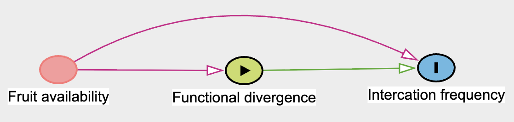

\pagebreak

# Introduction

Generative simulation demonstrating that data of *fruit availability* from one study in island can be used in a hierarchical model to de-confound the effect *functional divergence* $\rightarrow$ *interaction frequency* when fruit availability is missing in other studies. The challenge is that fruit availability confounds the relationship between functional divergence and interaction frequency, but it is rarely measured. Using a complete dataset, we show how Bayesian imputation within a hierarchical model can recover the true causal effect even when fruit availability is unobserved in most localities. The document is divided into sections, from an introduction defining the causal problem, to programming the generative simulation, fitting the model, and drawing conclusions.

:::{}
**Relevant terminology**

- *Causal effect*: A variable $X$ causes $Y$ if changing $X$ results in changes in $Y$.

- *Confounder*: A variable that affect both exposure ($X$) and outcome ($Y$), resulting on spurious relationships that distort the true causal effect ($X \rightarrow Y$).

- *Realized trophic niche*: The *n*-dimension functional space delimited by morphological and nutritional traits of the fruits a bird consume.

- *Functional divergence*: Euclidean distance of a fruit *i* to the centroid of the trophic realized niche of the bird.

:::

# Causal problem

We hypothesized that birds tend to select fruits whose traits are closer to a theoretical optimum that maximizes the consumer's benefits. Although birds only consume fruits that are filtered by the environment (i.e., available), we tested the idea that they still choose those fruits that are functionally closer to the theoretical optimum. Thus, we expect that birds interact preferentially with fruits closer to the centroid of their realized trophic niche, while those occupying the marginal area of the functional space (i.e., more functionally divergent) will be less frequent in the birds' diet.

Given the above assumptions, estimating the causal effect of *functional divergence* $\rightarrow$ *interaction frequency* requires controlling for local fruit availability for two main reasons. First, fruit availability directly affects interaction frequency because birds consume what is easier to find. Second, fruit availability also affects functional divergence because the functional space is estimated from the fruits that are available and then selected by birds. Thus, fruit availability creates a spurious association between functional divergence and interaction frequency, behaving as a classical confounding variable (Figure S1).


{width=60%}


The purpose of our generative simulation is to demonstrate that observed data of fruit availability in one study can be used in a Bayesian hierarchical model to impute missing fruit availability in other studies, and thereby recover the unbiased causal effect of *functional divergence* $\rightarrow$ *interaction frequency*. This provides proof that our modeling approach can validly estimate the causal effect even when fruit availability is unmeasured in most localities. The most important assumption underlying the simulations is that the effect of fruit availability on both functional divergence and interaction frequency is relatively consistent across studies. This assumption allows the reliable study to inform the imputation in other localities. Based on evidence from the literature and our own study in Oahu, we assumed these effects to be positive. To increase realism, the simulation incorporates several features of ecological data: (i) spatial covariance among studies, reflecting the fact that nearby localities share similar environmental conditions; (ii) hierarchical phylogenetic effects (species nested within genera within families); (iii) variation in sample sizes across studies; and (iv) multiple sampling locations within each study, simulating within-locality heterogeneity.

# Programming the simulation

## R packages

```{r, warning=FALSE, message=FALSE, results='hide'}

set.seed(23061993)

sapply(c('tibble', 'cmdstanr', 'dplyr', 'MASS', 
         'ggplot2', 'magrittr'), 
       library, character.only = T)
```

## Covariance matrix

The function `correlated_sites` uses a quadratic kernel to define a covariance matrix among sites based on a distance matrix. Then, the function generates spatially correlated residuals from a multivariate normal ($MVN$) distribution. The quadratic kernel determines that the covariance between pairs of localities decays exponentially with their squared distance:

$$
\begin{aligned}
& K_{ij} = \eta \cdot \text{exp}(-\rho \cdot D_{ij}^2) + \delta_{ij} \sigma^2
\end{aligned}
$$
Where $K_{ij}$ denotes the covariance between studies *i* and *j*, $D_{ij}$ is their geographic distance, $\eta$ is the marginal variance, and $\rho$ controls the rate of exponential decay. The term $\delta_{ij}\sigma^2$  adds extra variance to the diagonal for numerical stability. In our simulation, we set this  to a small value ($10^{-6}$) to ensure the covariance matrix is positive definite.


```{r}
correlated_sites <- function(eta, rho, mu, m){
  K <- matrix(0, ncol = 5, nrow = 5)
  for (i in 1:(5-1)) {
    for (j in (i+1):5) {
      K[i, j] <- eta * exp(-rho * (m[i, j])^2)
      K[j, i] <- K[i, j]
    }
  }
  diag(K) <- eta + 1e-6
  correlated_residuals <- 
    mvrnorm(1, 
            mu = rep(0, nrow(mat_distance)), 
            Sigma = K)
  
  correlated_residuals + mu
}

source('functions_mod_diagnostics.r') # functions for sampling diagnostics of
                                      # Bayesian models   

color <- # functions to manipulate `alpha` aesthetic in base plots
  function (acol, alpha = 0.2) {
    acol <- col2rgb(acol)
    acol <- rgb(acol[1]/255, acol[2]/255, acol[3]/255, alpha)
    acol
  }

path <- '/Users/andres/Documents/github_repos/HAWAII_temporal_dynamics_NETWORK_LEVEL/'

mat_distance <- readRDS(paste0(path, 'mat_distance_dites.rds'))[1:5, 1:5] + 1
# matrix of distance
```

## Definition of parameters 

First, we define the structural parameters of the simulation: the number of studies, their sample sizes, the number of sampling sites within each study, and the taxonomic dimensions (number of species, genera, and families) recorded across all studies. These parameters determine the hierarchical structure of the data and the sample sizes available for estimating each level of variation.

```{r}
N <- c(250, 320, 100, 300, 336)
N_sites <- c(5, 8, 2, 10, 6)
site_index <- 1:sum(N_sites)
N_studies <- 5
N_spp <- 35
N_genus <- 18
N_family <- 8
```

Parameters for covariance matrix and Gaussian processes

```{r}
rho <- 1.31 # Rate of covariance decline between points
eta <- 0.2 
```

Dispersion parameters among grouping variables

```{r}
sigma_studies <- 0.8
sigma_sites <- 0.25
sigma_sp <- 0.15
sigma_gen <- 0.2
sigma_fam <- 0.25
```

Defining parameters of grouping factors from probability distributions

```{r}
mu_studies <- rnorm(N_studies, 0, sigma_studies)
study <- correlated_sites(eta, rho, mu_studies, mat_distance) # correlated study locations
sites <- rnorm(sum(N_sites), 0, sigma_sites)
spp <- rnorm(N_spp, 0, sigma_sp)
genus <- rnorm(N_genus, 0, sigma_gen)
family <- rnorm(N_family, 0, sigma_fam)
```

Dispersion parameters for *functional divergence* and *interaction frequency* likelihoods
```{r}
sigma_X_var <- 0.5
sigma_Y_var <- 0.5
```


**Slope parametersn (global effects)**: 

:::{}
- `beta_x`: the negative effect of functional divergence on interaction frequency.

- `beta_fruit_X`: the effect of fruit availability on functional divergence.

- `beta_fruit_Y`: the effect of fruit availability on interaction frequency.
:::

```{r}
beta_x <- -0.25
beta_fruit_X <- 0.11
beta_fruit_Y <- 0.06
```


Assembling the simulation data structure by binding the study identifiers, site indices, and taxonomic assignments (species, genus, family) for each observation:

```{r}
rep_sites <- 
  unlist(sapply(N_sites, FUN = 
                function(x) {
                  indx <- which(N_sites == x)
                  rep(N[indx]/N_sites[indx], each = x)
                }))

INDEX_studies <- unlist(sapply(1:5, function(x) rep(x, each = N[x])))

INDEX_sites <- unlist(sapply(seq_along(site_index), 
                             function(i) rep(site_index[i], 
                                             each = rep_sites[i])))

sim_df <- 
  tibble(study = INDEX_studies, 
         sites = INDEX_sites) 


gen_fam <- tibble(genus = 1:N_genus, 
                  family = sample(1:N_family, N_genus, replace = T))

phylo_indx <- 
  do.call('rbind', 
        lapply(1:N_spp, FUN = 
                 function(i) {
                   as_tibble(cbind(tibble(sp = i),
                                   gen_fam[sample(1:18, 1), ]))
                 })) 

sim_df <- 
  cbind(sim_df, 
        phylo_indx[sample(1:N_spp, sum(N), replace = T), ]) |> 
  tibble()

```

Simulating *fruit availability* from a $\mathcal{N}(0, 1)$ distribution while incorporating the spatially correlated structure among sites:

```{r}
fruit_availability <- rnorm(sum(N)) + study[sim_df$study] * 0.2 
```

Simulating the causal structure from Figure S1

```{r}
simulated_X_Y <- 
  do.call('rbind', 
          lapply(1:sum(N), FUN = 
                   function(x) {
                     study_ <- sim_df$study[x]
                     site_ <- sim_df$sites[x]
                     sp_ <- sim_df$sp[x]
                     genus_ <- sim_df$genus[x]
                     family_ <- sim_df$family[x]
                     b_fruit_X <- beta_fruit_X#[study_]
                     b_fruit_Y <- beta_fruit_Y#[study_]
                     b_x <- beta_x#[study_]
                     
                     X <- rnorm(1, 
                                study[study_] + sites[site_] +
                                  spp[sp_] + genus[genus_] + family[family_] +
                                  b_fruit_X * fruit_availability[x], 
                                sigma_X_var)
                     
                     
                     
                     Y <- rnorm(1,
                             study[study_] + sites[site_] +
                               spp[sp_] + genus[genus_] + family[family_] +
                               b_fruit_Y * fruit_availability[x] + b_x * X,
                             sigma_Y_var)
                     
                     tibble(Y = Y, X = X)
                     
                   }))

sim_df <- as_tibble(cbind(sim_df, simulated_X_Y))

sim_df$fruit_availability <- fruit_availability

```

Here is our simulated data:

```{r, fig.height=3.5, fig.width=10, fig.cap= 'Simulated data based on the DAG and grouping factors of study, sampling site, and species taxonomy'}
par(mfrow = c(1, 3), mar = c(5, 5, 1, 1))
sim_df %$% plot(X, Y, 
                xlab = 'Functional divergence', 
                ylab = 'Interaction frequency', 
                col = color(1, 0.4), cex.lab = 1.5)
sim_df %$% plot(fruit_availability, X, 
                xlab = 'Fruit availability', 
                ylab = 'Interaction frequency', 
                col = color(1, 0.4), cex.lab = 1.5)
sim_df %$% plot(fruit_availability, Y, 
                xlab = 'Fruit availability', 
                ylab = 'Interaction frequency',
                col = color(1, 0.4), cex.lab = 1.5)
par(mfrow = c(1, 1))
```

Just by looking at the scatter plot between functional divergence and fruit availability, one would erroneously conclude a positive effect. This is exactly what confounding does: the true negative effect (`beta_x = -0.25`) is masked by the positive covariance that fruit availability induces between X and Y as it propagates through the causal structure. A naive simple linear model ($Y \sim X$) would yield a positive estimate, completely missing the true negative effect of -0.25:

```{r}
summary(lm(sim_df$Y ~ sim_df$X))
```

Now we remove the fruit availability data from four studies, leaving only Study 1 with complete observations:

```{r}
sim_df$fruit_availability_NA <- sim_df$fruit_availability
sim_df$fruit_availability_NA[which(sim_df$study > 1)] <- NA
```

This creates a missing data pattern where approximately 80% of fruit availability values are unobserved---one study provides the data for imputation, while the other four studies have no direct measurements of the confounder.

```{r}
mean(is.na(sim_df$fruit_availability_NA))
```

# Bayesian hierarchical model

## Mathematical notation

The main purpose of the following Bayesian hierarchical model is to estimate the causal effect *functional divergence* $\rightarrow$ *interaction frequency*. To accomplish this, the model uses observed data of *fruit availability* from one study to impute missing observations in the others. By conditioning on these imputed values, the model adjusts for confounding and recovers the unbiased causal effect. We achieve this by modeling the joint posterior distribution of the causal structure in Figure 1, treating missing fruit availability observations as latent variables.

:::{}

- *Y*: Interaction frequency

- *X*: Functional divergence

- *F*: Fruit availability

:::

We first define the vector for imputing missing values:

$$
\begin{aligned}
& ~~~~\mathcal{I}_{miss}:\text{index of missing F} \\
& ~~~~\mathcal{I}_{obs}:\text{index of observed F} \\
& \\
& F^{miss} = (F_i)_i\in\mathcal{I}_{miss} ~~~~~ \text{Laten variable } \\
& \\
&~~~~~ F_i =
\begin{cases}
F_i^{miss}~i \in\mathcal{I}_{miss} \\
F_i^{obs} ~~~i \in \mathcal{I}_{obs}\\
\end{cases}\\
\end{aligned}
$$
The missing values $F_i^{\text{mis}}$ are estimated jointly with all parameters, using information from the $F$, $X$, and $Y$ models:

$$
\begin{aligned}
& ~~~~~~~~~~~~~F_i \sim \mathcal{N}(\mu_F, \sigma_F) \\
& \mu_F = \alpha_F + \tau_F[study_i] + \theta_F[site_i] \\
& \\
& ~~~~~~~~~~~~~X_i \sim \mathcal{N}(\mu_x, \sigma_x) \\
& \mu_x = \alpha_x + \tau_x[study_i] + \theta_x[site_i] + \\
&~~~~~~~~~~ \delta_x[sp_i] + \gamma_x[genus_i] + \\
&~~~~~~~~~~ \phi_x[family_i] + \beta_{FX} \cdot F_i\\
& \\
& ~~~~~~~~~~~~~Y_i \sim \mathcal{N}(\mu_y, \sigma_y) \\
& \mu_y = \alpha_y + \tau_y[study_i] + \theta_y[site_i] + \\
&~~~~~~~~~~ \delta_y[sp_i] + \gamma_y[genus_i] + \\
&~\phi_y[family_i] + \beta_{FY} \cdot F_i + \beta_{XY} \cdot X_i \\
\end{aligned}
$$


Prior probabilities for the joint model:

$$
\begin{aligned}
&\alpha_{x, y, F} \sim \mathcal{N}(0, 1) \\
&\sigma_{x, y, y} \sim exp(1) \\
&\beta_{FX, FY, XY} \sim \mathcal{N}(0, 1) \\
& \theta_{x, y, F} = \mu_\theta + z_\theta \times \sigma_\theta \\
& \delta_{x, y, F} = \mu_\delta + z_\delta \times \sigma_\delta \\
& \gamma_{x, y, F} = \mu_\gamma + z_\gamma \times \sigma_\gamma \\
&  \phi_{x, y, F} = \mu_\phi + z_\phi \times \sigma_\phi \\
& \mu_{\theta, \delta, \gamma, \phi} \sim \mathcal{N}(0, 0.25) \\
& z_{\theta, \delta, \gamma, \phi} \sim \mathcal{N}(0, 0.25) \\
& \sigma_{\theta, \delta, \gamma, \phi} \sim exp(1) \\
& [K_m]_{ij} = \eta_{x, y, F} \cdot exp(-\rho_{x, y, F} \cdot d_{ij}^2) + \psi \cdot 0.001,  ~~ m \in \text{{F, X, Y}}\\
& LK_{ij} = [K_m]_{ij} \cdot [K_m]_{ij}^T \\
& \tau_{F, x, y} = LK_{F, x, y} \times z_\tau \\
& \eta_{x, y, F} \sim exp(3) \\
& z_\tau \sim \mathcal{N}(0, 0.5) \\
& \rho_{x, y, F} \sim exp(2) \\
\end{aligned}
$$

## `Stan` code

Hierarchical model in `Stan` code:

```{r, eval=FALSE}

cat('generative_model_NA.stan', file = 
      "
      functions {
  matrix GP_quadratic(matrix x, // distance matrix
                      real eta, 
                      real rho, 
                      real delta) {
                        
                        int N = dims(x)[1];
                        matrix[N, N] K;
                        
                        for (i in 1:(N-1)) {
                          K[i, i] = eta + delta;
                          for (j in (i+1):N) {
                            K[i, j] = eta * exp(-rho*square(x[i, j]));
                            K[j, i] = K[i, j];
                          }
                        }
                        K[N,N] = eta + delta;
                        return(cholesky_decompose(K));
                      }
}

data {
  int N;
  int N_study;
  int N_sites;
  int N_spp;
  int N_genus;
  int N_family;
  int N_na;
  int N_no_na;
  array[N] int study;
  array[N] int sites;
  array[N] int sp;
  array[N] int genus;
  array[N] int family;
  array[N_na] int index_na;
  array[N_no_na] int index_no_na;
  vector[N] X;
  vector[N] Y;
  vector[N_no_na] fruit_availability_OBS;
  matrix[N_study, N_study] dist_mat;
  
}

parameters {
  
  // random effects
  vector[N_study] z_study_Y;
  real<lower = 0> rho_Y;
  real<lower = 0> eta_Y;
  
  vector[N_sites] z_sites_Y;
  real mu_sites_Y;
  real<lower = 0> sigma_sites_Y;
  
  vector[N_study] z_study_X;
  real<lower = 0> rho_X;
  real<lower = 0> eta_X;
  
  vector[N_study] z_study_f;
  real<lower = 0> rho_f;
  real<lower = 0> eta_f;
  
  vector[N_sites] z_sites_X;
  real mu_sites_X;
  real<lower = 0> sigma_sites_X;
  
  vector[N_sites] z_sites_F;
  real mu_sites_F;
  real<lower = 0> sigma_sites_F;
  
  vector[N_spp] z_sp;
  real mu_sp;
  real<lower = 0> sigma_sp;
  
  vector[N_genus] z_genus;
  real mu_genus;
  real<lower = 0> sigma_genus;
  
  vector[N_family] z_family;
  real mu_family;
  real<lower = 0> sigma_family;
  
  vector[N_spp] z_sp_x;
  real mu_sp_x;
  real<lower = 0> sigma_sp_x;
  
  vector[N_genus] z_genus_x;
  real mu_genus_x;
  real<lower = 0> sigma_genus_x;
  
  vector[N_family] z_family_x;
  real mu_family_x;
  real<lower = 0> sigma_family_x;
  
  vector[N_na] fruit_missing;
  
  real beta_fruit_X;
  real beta_fruit_Y;
  real beta_X;
  real alpha_X;
  real alpha_f;
  real alpha_Y;
  real<lower = 0> sigma_Y;
  real<lower = 0> sigma_f;
  real<lower = 0> sigma_X;
  
}

transformed parameters{
  matrix[N_study, N_study] K_Ly;
  vector[N_study] STUDY_Y;
  K_Ly = GP_quadratic(dist_mat, eta_Y, rho_Y, 0.001);
  STUDY_Y = K_Ly * z_study_Y;
  
  matrix[N_study, N_study] K_Lx;
  vector[N_study] STUDY_X;
  K_Lx = GP_quadratic(dist_mat, eta_X, rho_X, 0.001);
  STUDY_X = K_Lx * z_study_X;
  
  matrix[N_study, N_study] K_Lf;
  vector[N_study] STUDY_F;
  K_Lf = GP_quadratic(dist_mat, eta_f, rho_f, 0.001);
  STUDY_F = K_Lf * z_study_f;
  
  vector[N_sites] SITE_Y;
  SITE_Y = mu_sites_Y + z_sites_Y * sigma_sites_Y;
  
  vector[N_sites] SITE_X;
  SITE_X = mu_sites_X + z_sites_X * sigma_sites_X;
  
  vector[N_sites] SITE_F;
  SITE_F = mu_sites_F + z_sites_F * sigma_sites_F;
  
  vector[N_spp] SP;
  SP = mu_sp + z_sp * sigma_sp;
  
  vector[N_genus] GENUS;
  GENUS = mu_genus + z_genus * sigma_genus;
  
  vector[N_family] FAMILY;
  FAMILY = mu_family + z_family * sigma_family;
  
  vector[N_spp] SP_x;
  SP_x = mu_sp_x + z_sp_x * sigma_sp_x;
  
  vector[N_genus] GENUS_x;
  GENUS_x = mu_genus_x + z_genus_x * sigma_genus_x;
  
  vector[N_family] FAMILY_x;
  FAMILY_x = mu_family_x + z_family_x * sigma_family_x;
  
  vector[N] fruit_all;
  fruit_all[index_no_na] = fruit_availability_OBS;
  fruit_all[index_na] = fruit_missing;
  
}

model {
  alpha_f ~ normal(0, 1); 
  alpha_X ~ normal(0, 1); 
  alpha_Y ~ normal(0, 1); 
  
  beta_X ~ normal(0, 1);
  
  beta_fruit_X ~ normal(0, 1);
  
  beta_fruit_Y ~ normal(0 , 1);
  
  eta_Y ~ exponential(3);
  z_study_Y ~ normal(0, 0.5);
  rho_Y ~ exponential(1);
  
  eta_X ~ exponential(3);
  z_study_X ~ normal(0, 0.5);
  rho_X ~ exponential(1);
  
  eta_f ~ exponential(3);
  z_study_f ~ normal(0, 0.5);
  rho_f ~ exponential(1);
  
  z_sites_Y ~ normal(0, 0.5);
  mu_sites_Y ~ normal(0, 0.25);
  sigma_sites_Y ~ exponential(2);
  
  z_sites_X ~ normal(0, 0.5);
  mu_sites_X ~ normal(0, 0.25);
  sigma_sites_X ~ exponential(2);
  
  z_sites_F ~ normal(0, 0.5);
  mu_sites_F ~ normal(0, 0.25);
  sigma_sites_F ~ exponential(2);
  
  z_sp ~ normal(0, 0.5);
  mu_sp ~ normal(0, 0.25);
  sigma_sp ~ exponential(2);
  
  z_genus ~ normal(0, 0.5);
  mu_genus ~ normal(0, 0.25);
  sigma_genus ~ exponential(2);
  
  z_family ~ normal(0, 1);
  mu_family ~ normal(0, 0.25);
  sigma_family ~ exponential(2);
  
  z_sp_x ~ normal(0, 1);
  mu_sp_x ~ normal(0, 0.25);
  sigma_sp_x ~ exponential(2);
  
  z_genus_x ~ normal(0, 1);
  mu_genus_x ~ normal(0, 0.25);
  sigma_genus_x ~ exponential(2);
  
  z_family_x ~ normal(0, 0.5);
  mu_family_x ~ normal(0, 0.25);
  sigma_family_x ~ exponential(2);
  
  sigma_f ~ exponential(1);
  sigma_Y ~ exponential(1);
  sigma_X ~ exponential(1);
  
  fruit_all ~ normal(alpha_f + STUDY_F[study] + SITE_F[sites],
                     sigma_f);
  
  X ~ normal(alpha_X + STUDY_X[study] + SITE_X[sites] +
                  SP_x[sp] + GENUS_x[genus] + FAMILY_x[family] +
                  beta_fruit_X*fruit_all, 
                  sigma_X);
  
  Y ~ normal(alpha_Y + STUDY_Y[study] + SITE_Y[sites] +
                  SP[sp] + GENUS[genus] + FAMILY[family] +
                  beta_X*X + beta_fruit_Y*fruit_all, 
                  sigma_Y);
  
}

generated quantities {
  array[N] real ppcheck;

  ppcheck = normal_rng(alpha_Y + STUDY_Y[study] + SITE_Y[sites] +
                       SP[sp] + GENUS[genus] + FAMILY[family] +
                       beta_X*X + beta_fruit_Y*fruit_all,
                       sigma_Y);
}

    ")

```

## Model fitting 

Formatting the data in a `list` object

```{r}
diag(mat_distance) <- 0
dat <- lapply(sim_df, function(x) x)

dat$N <- sum(N)
dat$N_study <- N_studies
dat$N_sites <- sum(N_sites)
dat$N_spp <- N_spp
dat$N_genus <- N_genus
dat$N_family <- N_family
dat$N_na <- length(which(is.na(dat$fruit_availability_NA)))
dat$N_no_na <- length(which(!is.na(dat$fruit_availability_NA)))
dat$index_na <- which(is.na(dat$fruit_availability_NA))
dat$index_no_na <- which(!is.na(dat$fruit_availability_NA))
dat$dist_mat <- mat_distance
dat$fruit_availability_OBS <- as.vector(na.omit(dat$fruit_availability_NA))
```

Running the MCMC algorithm 

```{r, eval=FALSE}
file <- paste0(getwd(), '/generative_model_NA.stan')
fit_na <- cmdstan_model(file, compile = T)

model_na <- 
  fit_na$sample(
    data = dat[-grep('NA', names(dat))], 
    chains = 4, 
    parallel_chains = 4, 
    iter_warmup = 500, 
    iter_sampling = 4e3, 
    thin = 5, 
    seed = 23061993
  )
```

```{r, echo=FALSE}
model_na <- readRDS('generative_model.rds')
```


## Sampling diagnostics

```{r, fig.cap='Sampling diagnostics of the Bayesian model. Left: Rhat vs tail and bulk effective sampling size (ess). Right: Posterior predictive simulations (blue lines) and observed interaction frequency (red line)', fig.height=3.5, fig.width=10}
summary_na <- model_na$summary()
par(mfrow = c(1, 3))
mod_diagnostics(model_na, summary_na)
ppcheck <- model_na$draws('ppcheck', format = 'matrix')
plot(density(dat$Y), lwd = 0, main = '', 
     xlab = 'Interaction frequency', ylim = c(0, 0.6))
for (i in 1:200) {
  lines(density(ppcheck[i, ]), col = color(4, 0.5))
}
lines(density(dat$Y), lwd = 3, col = color(2, 0.7))
```

# Results 

## Posterior distributions and model validation

```{r}

post <- model_na$draws(c('alpha_Y',
                         'STUDY_Y', 
                         'SITE_Y', 
                         'SP', 
                         'GENUS', 
                         'FAMILY',
                         'beta_X',
                         'beta_fruit_Y',
                         'beta_fruit_X',
                         'sigma_Y'), format = 'df')

```


Now, let's check whether the model recovered the true parameter values.


```{r, fig.cap='Posterior distribution of the slope parameters (density lines) and their true values (vertical dashed lines)'}
beta_post <- model_na$draws(c('beta_X',
                              'beta_fruit_Y',
                              'beta_fruit_X'), format = 'df')

plot(NULL, xlim = c(-0.4, 0.3), ylim = c(0, 15), 
     ylab = 'Density', xlab = expression(beta))
for (i in 1:3) lines(density(beta_post[[i]]), col = i, lwd = 3)
abline(v = c(beta_x, beta_fruit_X, beta_fruit_Y), 
       col = 1:3, lty = 2)
legend(x = 0.15, y = 15, legend = c('True effects', 
                                   'Estimated XY', 
                                   'Estimated ZY', 
                                   'Estimated ZX'), 
       lty = c(3, 1, 1, 1), lwd = c(1, 3, 3, 3), 
       col = c(1, 1:3), 
       cex = 0.5)

```

Remember that just looking at the raw data we could conclude that the effect of functional divergence on interaction frequency was positive. Here, by looking at Figure S4, we note that the model recover the true negative effect (`beta_x = -0.25`), meaning that is successfully de-confound out target causal effect.

Now lets take a look at the *fruit availability* latent variables, plotting real values and imputed: 

Remember that, just by looking at the raw data, we would erroneously conclude that the effect of functional divergence on interaction frequency is positive. Here, in Figure S4, we see that the model recovers the true negative effect (`beta_x = -0.25`), indicating that it successfully de-confounds the target causal effect.

To further validate the imputation procedure, we now examine the latent fruit availability variables. Figure S5 plots the imputed values against the true (simulated) values:

```{r, fig.height=5, fig.width=10, fig.cap='Observed fruit availability vs posterior distribution of imputed values. Open circles denote median values and vertical error bars their 95% credibility intervals. Small green dots represent observed values'}
imputed_fruit <- model_na$draws('fruit_all', format = 'df')

imputed_fruit <- imputed_fruit[, grep('^frui', colnames(imputed_fruit))]

plot(NULL, ylim = c(-4, 6), xlim = c(1, sum(N)), 
     ylab = 'Fruit availability')
tibble(li = apply(imputed_fruit, 2, quantile, 0.025),
       ls = apply(imputed_fruit, 2, quantile, 0.975), 
       x = 1:sum(N)) %$%
  segments(x0 = x, y0 = li, y1 = ls)
tibble(mu = apply(imputed_fruit, 2, median), 
       x = 1:sum(N)) %$% 
  points(x, mu, col = 'tan1') 
points(1:sum(N), 
       dat$fruit_availability, 
       pch = 16, cex = 0.5, 
       col = 'cyan4')
legend(x = 750, y = 6, 
       legend = c('Observed', 
                  'Median imputation', 
                  '95% CI of imputation'), 
       pch = c(16, 1, 16), pt.cex = c(0.5, 1, 0), 
       col = c('cyan4', 'tan1', 'black'), 
       lty=c(0, 0, 1))
```

Note that the posterior distribution of imputed values is positioned around the average value of the variable---a consequence of partial pooling that shrinks extreme estimates toward the global mean---and the 95% credibility intervals cover the unobserved true values. Since imputed values are estimated considering the likelihood of $F_i$, and the $F_i \rightarrow X_i$ and $F_i \rightarrow Y_i$ effects, the model successfully recovers the positive covariance between missing fruit availability values and interaction frequency. This covariance preservation is essential for properly adjusting for confounding in the causal model.

```{r, fig.height=5, fig.width=10, fig.cap= 'Scatter plot of interaction frequency and fruit availability. Colors indicate the imputed values of fruit availability. The left panel shows the full range of the x-axis, whereas the right panel shows a zoom to the imputed values'}
fruit_imp <- apply(imputed_fruit, 2, median)


par(mfrow = c(1, 2))
plot(dat$Y[!is.na(dat$fruit_availability_NA)] ~ 
       fruit_imp[!is.na(dat$fruit_availability_NA)], 
     col = 'black', 
     ylim = c(-3, 2), 
     main = 'Full range of fruit availability', 
     xlab = 'Fruit availability', 
     ylab = 'Interaction frequency')
points(dat$Y[is.na(dat$fruit_availability_NA)] ~ 
         fruit_imp[is.na(dat$fruit_availability_NA)], 
       col = color(2, 0.5), 
       cex = 0.5, pch = 16)
legend(x = -3, y = 1.8, 
       legend = c('Observed', 
                 'Imputed'), 
       pch = c(1, 16), 
       col = c('black', 'tomato3'), 
       cex = 0.75)
plot(dat$Y[!is.na(dat$fruit_availability_NA)] ~ 
       fruit_imp[!is.na(dat$fruit_availability_NA)], 
     col = 'black', 
     ylim = c(-3, 2), xlim = c(-0.5, 0.5), 
     main = 'Zoom to imputed values', 
     xlab = 'Fruit availability', 
     ylab = '')
points(dat$Y[is.na(dat$fruit_availability_NA)] ~ 
         fruit_imp[is.na(dat$fruit_availability_NA)], 
       col = color(2, 0.5), 
       cex = 0.5, pch = 16)
par(mfrow = c(1, 1))
```

Finally, we can visualize the adjusted relationship by calculating partial residuals from the model. After removing the variance explained by grouping factors and fruit availability, the remaining association between functional divergence and interaction frequency reveals the true estimated effect:

```{r}

post <- lapply(c('alpha_Y',
                 'STUDY_Y', 
                 'SITE_Y', 
                 'SP',
                 'GENUS',
                 'FAMILY',
                 '^beta',
                 'sigma_Y'), FUN = 
                 function(x) {
                   post[, grep(x, colnames(post))]
                 })

names(post) <- c('alpha',
                 'STUDY', 
                 'SITE', 
                 'SP',
                 'GENUS',
                 'FAMILY',
                 'beta',
                 'sigma_Y')

par_res_Y <- 
  lapply(1:length(dat$study), FUN = 
           function(x) {
             study_ <- dat$study[x]
             site <- dat$sites[x]
             sp <- dat$sp[x]
             genus <- dat$genus[x]
             family <- dat$family[x]
             Z <- fruit_imp[x]
             Y <- dat$Y[x]
             
             Y_hat <- 
               with(post, 
                    {
                      alpha[[1]] +
                        STUDY[, study_, drop = T] +
                        SITE[, site, drop = T] +
                        SP[, sp, drop = T] +
                        GENUS[, genus, drop = T] +
                        FAMILY[, family, drop = T] +
                        beta$beta_fruit_Y * Z
                    })
             
             tibble(cond_residual = Y - median(Y_hat))
           })

par_res_Y <- do.call('rbind', par_res_Y)

est_XY <- 
  lapply(1, FUN = 
           function(i) {
             
             study_ <- apply(post$STUDY, 1, median)
             site <- apply(post$SITE, 1, median)
             sp <- apply(post$SP, 1, median)
             genus <- apply(post$GENUS, 1, median)
             family <- apply(post$FAMILY, 1, median)
             Z <- median(fruit_imp)
             
             est <- 
               lapply(seq(min(dat$X), 
                          max(dat$X), 
                          length.out = 100), FUN = 
                        function(X) {
                          
                          Y_hat <- 
                            with(post, 
                                 {
                                   alpha[[1]] +
                                     study_ +
                                     site +
                                     sp +
                                     genus +
                                     family +
                                     beta$beta_fruit_Y * Z +
                                     beta$beta_X * X
                                 })
                          
                          tibble(mu = median(Y_hat), 
                                 li = quantile(Y_hat, 0.025), 
                                 ls = quantile(Y_hat, 0.975), 
                                 x = X)
                        })
             
             est
             
           })[[1]]

est_XY <- do.call('rbind', est_XY)
```


```{r, fig.cap='Causal effect of functional divergence and interaction frequency', fig.height=5, fig.width=10}
plot(par_res_Y$cond_residual ~ dat$X, cex = 0.5, 
     col = color(1, alpha = 0.5),
     ylab = 'Partial residuals of interaction frequency', 
     xlab = 'Functional divergence', cex.lab = 1)
lines(est_XY$x, est_XY$mu, col = 'tomato', lwd = 2)
lines(est_XY$x, est_XY$li, lty = 3, col = 'tomato', lwd = 2)
lines(est_XY$x, est_XY$ls, lty = 3, col = 'tomato', lwd = 2)
```

## Conclusion

Our generative simulation demonstrates that a hierarchical modeling approach---combined with imputation of missing fruit availability using data from a single reliable `study`---can successfully de-confound the global effect of functional divergence on interaction frequency. The strongest assumption underlying our simulation is that the effect of fruit availability on interaction frequency is relatively constant in both magnitude and direction across studies. In other words, we assume that the positive effect estimated in our Oahu dataset is representative of this relationship in other localities. This assumption is ecologically reasonable, as abundance (fruit availability in our study) is well established as a strong and consistent predictor of pairwise interaction frequency in mutualistic networks.


# Computational environment

```{r}
sessionInfo()
```

